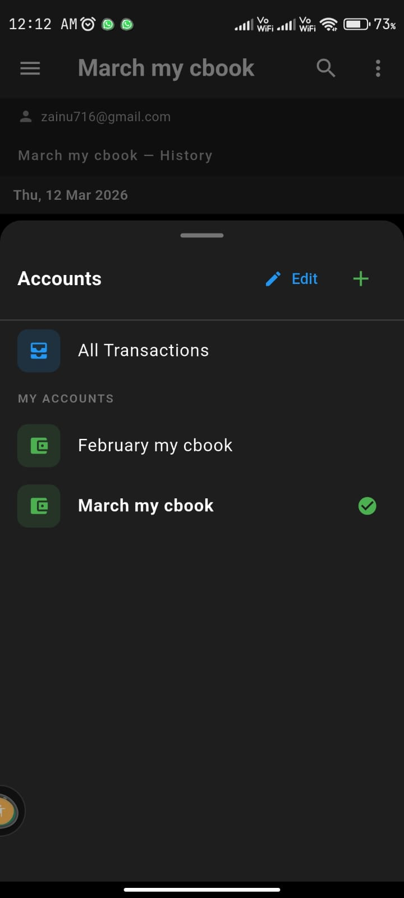
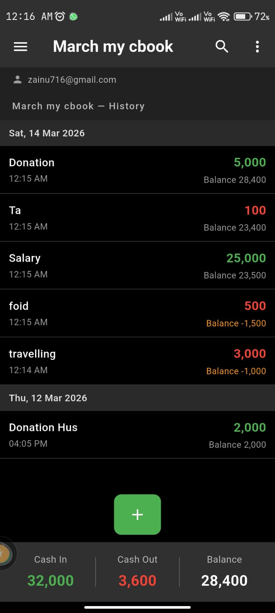
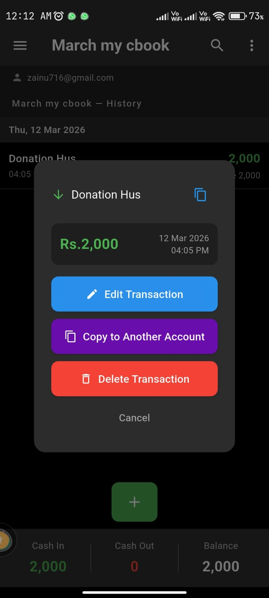
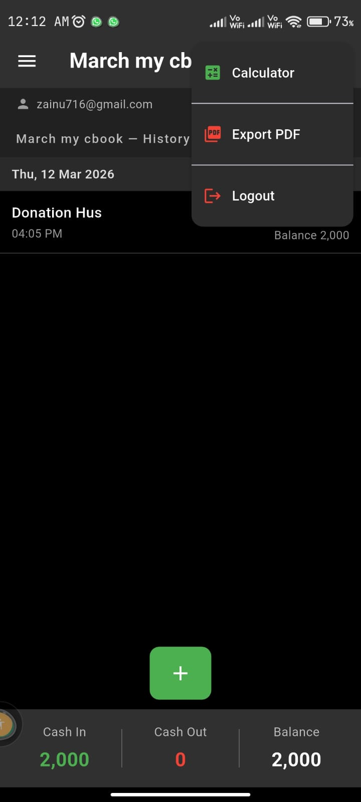

# Personal Expense Manager

A Flutter mobile app for managing personal expenses with Firebase backend.

## Features
- Multi-account management
- Real-time transaction sync (Firebase Firestore)
- Firebase Authentication
- Running balance per transaction
- Date-grouped transaction list
- Copy transactions across accounts
- PDF export
- Search and filter
- Draggable floating calculator
- Indian number formatting

## Tech Stack
- Flutter & Dart
- Firebase Firestore
- Firebase Authentication
- Provider (State Management)
- SharedPreferences
- PDF & Printing packages

## App Screenshots

